# 🧠 Chatrock – AI-Powered Language Learning Platform

**Chatrock** is an intelligent language learning platform that empowers users to enhance their language skills through real-time, interactive conversations with an AI chatbot. Blending personalized learning paths, gamified challenges, and progress tracking, Chatrock offers a fun, adaptive, and engaging experience. The platform is powered by the OpenAI API and built using PHP, MySQL, JavaScript, HTML, and CSS.

---

## 🌟 Key Features

- 💬 Real-time conversation practice using OpenAI’s language model
- 🎯 Personalized learning paths that adapt to user progress and goals
- 🎮 Gamified learning modules including quizzes, reading tasks, and vocabulary games
- 📊 Progress tracking through dashboards and performance metrics
- 🧩 Grammar and vocabulary training tailored to different levels
- 📚 Interactive reading exercises with integrated note-taking
- 👥 Admin panel for managing users and monitoring engagement
- 🔐 Secure login and role-based authentication (students, instructors, admins)

---

## 🖼️ Screenshots

### 🚀 Landing Page
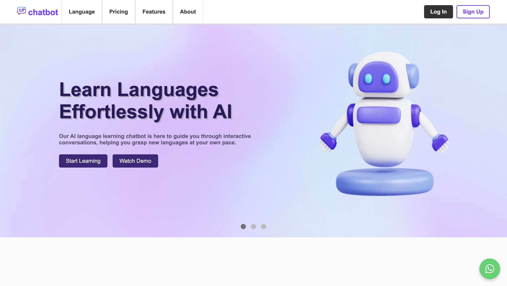
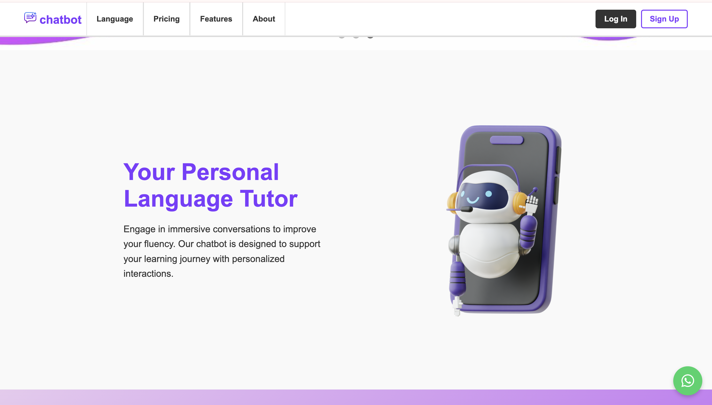
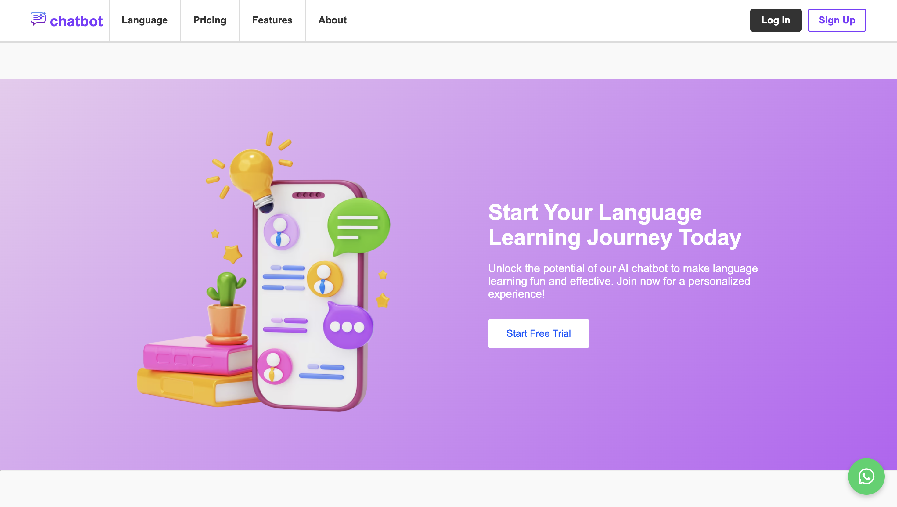
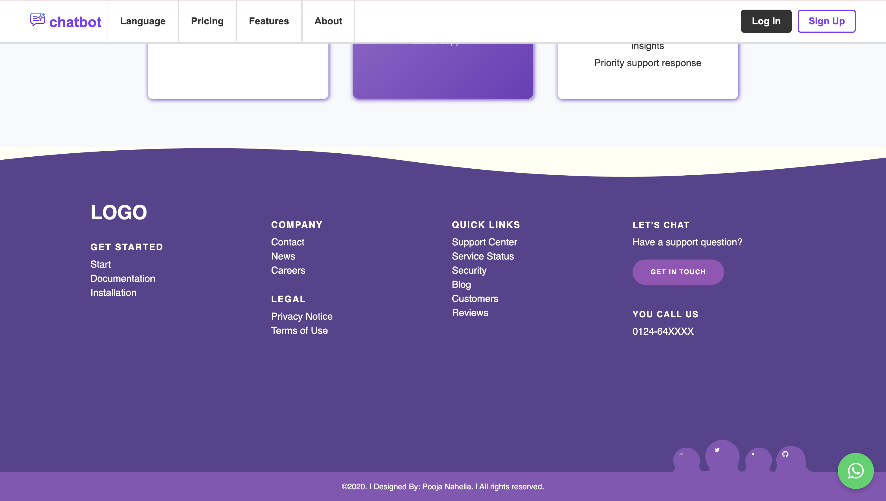

### 🔐 Log In & Sign Up
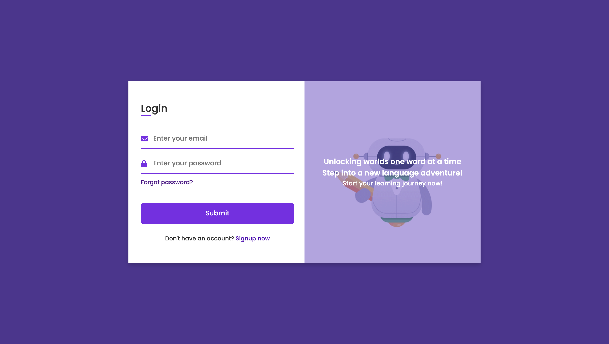

### 🏠 Home & Chat Interface
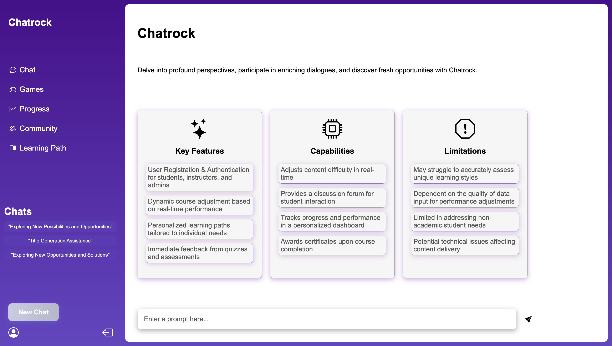
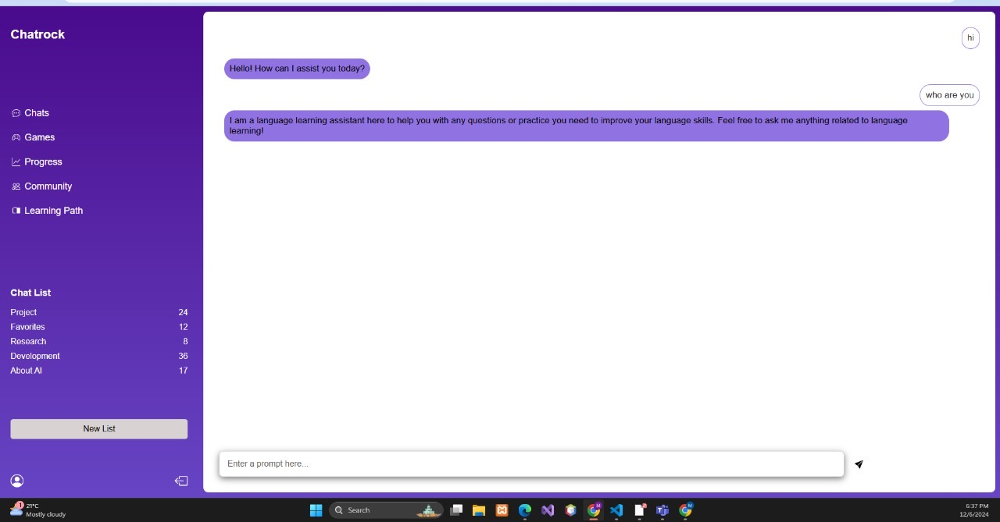
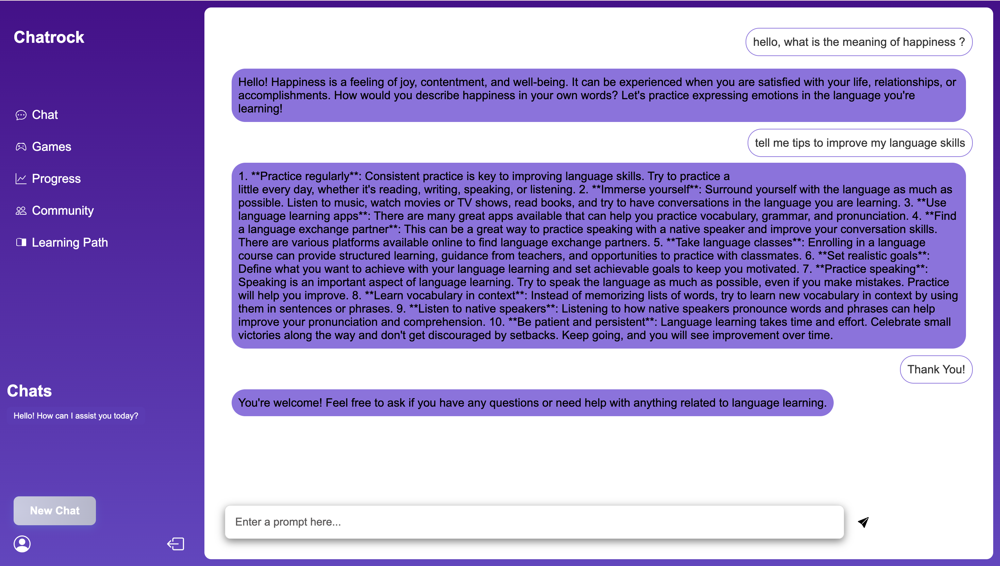

### 🎮 Games & Training
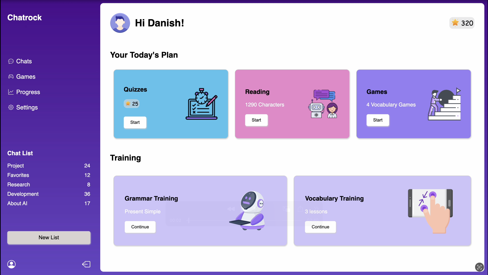
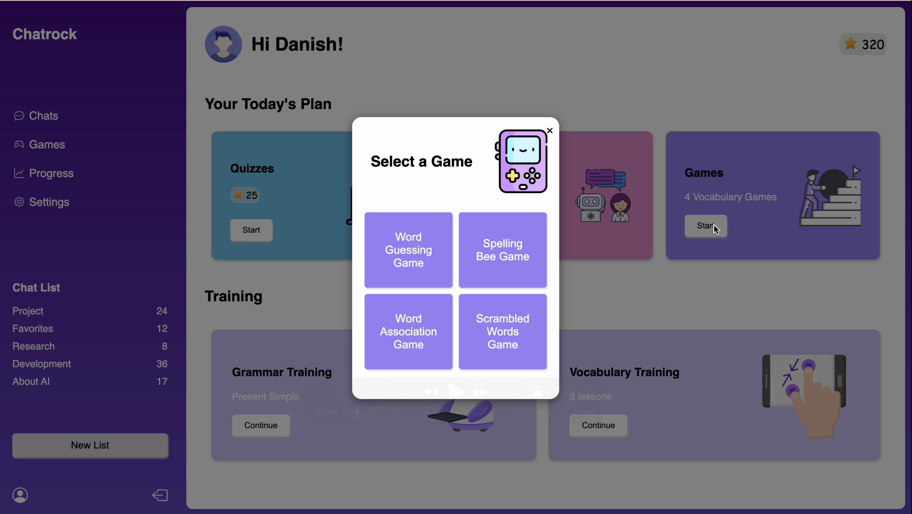

### 📖 Reading Exercise
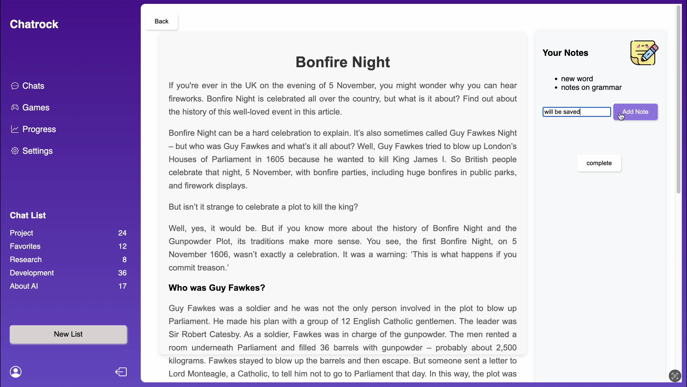

### 👤 User Profile
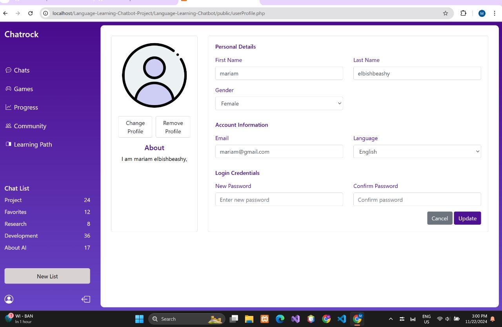

### 🛠️ Admin Dashboard
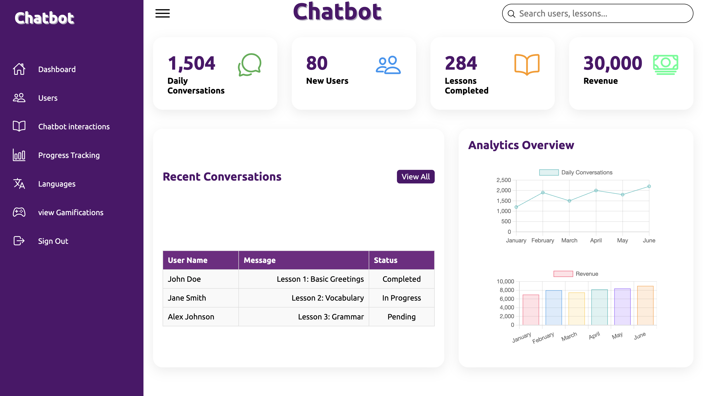

---

## 🧪 Tech Stack

  
  
  

---

## 🔑 How It Works

1. Users sign up and log in with secure credentials.
2. The chatbot interacts in natural language, supporting learning through conversation.
3. Users complete gamified tasks including quizzes, vocabulary games, and reading activities.
4. Personalized paths and difficulty levels are adjusted based on performance.
5. Dashboards help track individual learning progress.
6. Admins manage platform users and oversee engagement via the admin panel.

---

